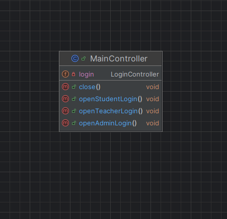

**#Title: Student Information System (SIS)**

Description:
The Student Information System (SIS) is a software application designed to manage and store data related to students, teachers, courses, and grades. The system allows user to choose their role, student can see their grades, while teachers can manage their students and grades. The admin has full control over the system, including adding and removing.

Project Requirements List:

1. Role-Based Access Control: Users log in as students, teachers, or administrators, accessing functionalities pertinent to their roles.
2. Secure Authentication: Login system requiring an email and a more than 3-character password containing only Latin letters and at least one digit.
3. Student Dashboard: Students can view their enrolled courses and corresponding grades.
4. Teacher Dashboard: Teachers can view courses they teach, see enrolled students, and assign grades.
5. Administrator Panel: Administrators can view all courses, add or delate students
6. Course Management: Courses such as Python, Java
7. Grade Management: Teachers can assign and update grades for students in their
courses.
8. User Management: Administrators can add or remove student and teacher accounts.
9. Data Persistence: All data is stored in an SQLite database, ensuring persistence across sessions.
10.MVC Architecture: The application follows the Model-View-Controller design pattern, promoting organized and maintainable code.

Team Members List:
Mukadas Adylbekova 
Zhoomart kyzy Zhamal
Farkhad Arziev

Roles of Group Members: 
Mukadas Adylbekova -  Frontend Developer, Backend Developer,  Presentation Specialist
Zhoomart kyzy Zhamal - Frontend Developer, Backend Developer,  Project Manager
Farkhad Arziev - Backend Developer, Meeting Documentation Specialist,  README and GitHub Specialist 

 Screenshots:

 UML Class Diagram:
 Controllers UML Diagrams
  
  
  
  
  
  
  Models UML Diagrams
  
  
  
  

  

 Weekly Meeting Documentation:
 https://docs.google.com/document/d/1n4Swnt6YNw0u9eKIPPunduoecjVli8QrZ3BRh1CEmsU/edit?usp=sharing
